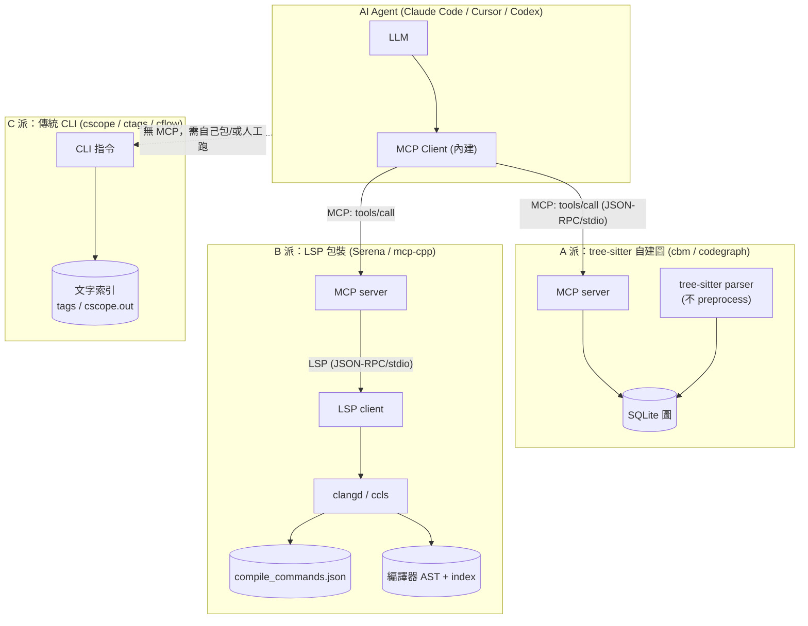
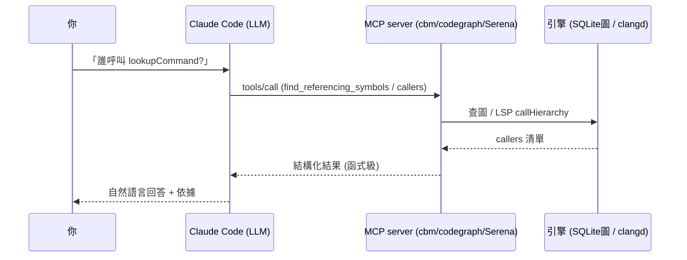

# 架構、協定與 Claude Code 對接

本文說明每個受測工具的**架構**、**用什麼協定**、**參數**、以及**怎麼接進 Claude Code**。

---

## 1. 三派架構總覽



| 派別 | 索引方式 | 對 agent 的協定 | 內部協定 | 需要 build? |
|------|---------|----------------|---------|------------|
| **A：tree-sitter**（cbm/codegraph） | tree-sitter parse → SQLite 圖 | **MCP**（JSON-RPC/stdio） | 無 | ❌ |
| **B：LSP 包裝**（Serena/mcp-cpp） | clangd 編譯器前端 | **MCP** | **LSP**（JSON-RPC/stdio）→ clangd | ✅ 需 compile_commands.json |
| **C：傳統**（cscope/ctags/cflow） | 文字掃描 → tags/cscope.out | **無**（CLI，需自己包成 MCP 或人工） | 無 | ❌ |

---

## 2. 協定細節

### MCP（Model Context Protocol）— agent ↔ 工具
- 傳輸：**JSON-RPC 2.0 over stdio**（也支援 SSE / streamable-http）。
- 握手：`initialize` → `notifications/initialized` → `tools/list` → `tools/call`。
- 這是 Claude Code 與**所有 MCP server**（cbm/codegraph/Serena/mcp-cpp）溝通的方式。
- 例（呼叫工具）：
  ```json
  {"jsonrpc":"2.0","id":3,"method":"tools/call",
   "params":{"name":"find_referencing_symbols","arguments":{"name_path":"t_add","relative_path":"."}}}
  ```

### LSP（Language Server Protocol）— B 派內部 → clangd
- 傳輸：**JSON-RPC 2.0 over stdio**。
- 關鍵方法：`initialize`、`textDocument/didOpen`、`textDocument/references`、`textDocument/documentSymbol`、`textDocument/prepareCallHierarchy` → `callHierarchy/incomingCalls`（= 「誰呼叫」）。
- clangd 參數：`--compile-commands-dir=<dir>`、`--background-index`、`--log=error`、`--query-driver`。
- 本 benchmark 用 `bench/clangd_callers.py` 直接驅動 clangd 的 callHierarchy（即 Serena `find_referencing_symbols` 底層做的事）。

### compile_commands.json（Clang 編譯資料庫）
- 格式：`[{ "directory":..., "command"/"arguments":..., "file":... }, ...]`，一條 = 一個 translation unit 的編譯方式（含 `-DCONFIG_*`、`-I` 等）。
- 產生：`bear -- make`、CMake `-DCMAKE_EXPORT_COMPILE_COMMANDS=ON`、或手寫。
- **決定 clangd 的 #ifdef 評估與跨檔解析**（見 REPORT 第 8 節：無它 clangd 只剩同檔）。

### 傳統工具（無協定）
- `ctags -R .` → `tags`；`cscope -bqk -R` → `cscope.out`；`cflow *.c`。
- 純 CLI + on-disk 索引，**無 server/協定**。要接 agent 需自己包一層（如 felipeerias 把 clangd 包成 MCP 的做法）。

---

## 3. 各工具參數速查

| 工具 | 索引 | 「誰呼叫 X」 | 關鍵參數 |
|------|------|-------------|---------|
| **cbm** | `codebase-memory-mcp cli index_repository '{"repo_path":...,"mode":"full"}'` | `cli trace_path '{"function_name":"X","direction":"inbound"}'` 或 `cli query_graph '{Cypher}'` | `CBM_CACHE_DIR`、`mode: full/moderate/fast`、`--json` |
| **codegraph** | `codegraph init .` | `codegraph callers X -p . -j` | `-j/--json`、`-d/--depth`、`CODEGRAPH_MCP_TOOLS` |
| **clangd** | （需 compile_commands.json）`--background-index` | LSP `callHierarchy/incomingCalls` | `--compile-commands-dir`、`--query-driver` |
| **Serena** | `serena start-mcp-server --project <path>` | MCP `find_referencing_symbols{name_path,relative_path}` | `--context`、`--transport stdio/sse`、`--project` |
| **cscope** | `cscope -bqk -R` | `cscope -dL3 X`（-L3 = find functions calling X） | `-L<n>`（查詢類型 0-9） |
| **ctags** | `ctags -R .` | ❌（只有定義） | `--c-kinds`、`--fields` |
| **cflow** | `cflow *.c` | `cflow -r`（反向呼叫圖） | `--depth`、`-r/--reverse` |

---

## 4. 怎麼接進 Claude Code

### A/B 派（MCP server）— 一行加入
```bash
# cbm
claude mcp add codebase-memory -s user -- /path/to/codebase-memory-mcp
# codegraph（自帶安裝器寫入 ~/.claude.json）
codegraph install         # 自動偵測並設定 Claude Code/Cursor/...
# Serena
claude mcp add serena -- uvx --from git+https://github.com/oraios/serena \
  serena start-mcp-server --context ide-assistant --project $(pwd)
# mcp-cpp（Rust，吃 compile_commands.json）
claude mcp add mcp-cpp -- /path/to/mcp-cpp --compile-commands ./build
```
加完後 Claude Code 的 LLM 會看到這些工具（`/mcp` 可列出），自動在需要時 `tools/call`。

### C 派（傳統工具）— 無原生 MCP
- 三條路：① 人工在 shell 跑、把結果貼給 agent；② 用社群封裝（如把 cscope/clangd 包成 MCP，felipeerias/clangd-mcp-server 即此類）；③ 寫 Claude Code 的自訂 hook / skill 包一層。
- 這也是為什麼「clangd MCP」這類專案存在：把強大但無協定的傳統/編譯器工具，補上 MCP 介面給 agent。


