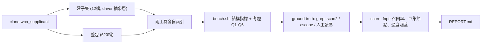

# codebase-memory-mcp-pro vs CodeGraph：C 程式碼實測報告（wpa_supplicant）

> 受測：`win4r/codebase-memory-mcp-pro`（cbm，自 build）vs `colbymchenry/codegraph` 1.1.1
> 題目：`digsrc/wpa_supplicant`（620 C/H 檔；`wpa_driver_ops` 128 函式指標欄位；3,141 `#ifdef`）
> 日期：2026-06-26｜平台：macOS, Apple Silicon｜本報告所有數字皆實跑可複現（`results/` 留存原始輸出）

---

## 0. 結論速覽（先看這個）

| 你的需求 | 推薦 | 理由（實測） |
|---------|------|-------------|
| **任何「誰呼叫誰」的函式級呼叫圖** | **CodeGraph** | 直接呼叫圖召回 **93%**（cbm **0%**）；cbm 的呼叫邊 99% 掛在「檔案」而非「函式」（見 3.5 ★） |
| **追函式指標分派**（`drv->ops->scan()` 接到誰） | **CodeGraph** | 合成器召回 **3/5 (60%)**；cbm **0/5** |
| **巨集當一等公民 / 查巨集** | **cbm** | 抽 **3,395 個 Macro 節點**；codegraph 不抽巨集 |
| **自訂圖查詢（任意 Cypher）** | **cbm** | `query_graph` 支援 openCypher；codegraph 無查詢語言 |
| **符號清單（struct/enum/func 列舉）** | 平手 | 基本建構召回都 85–100%（見 3.5） |
| **索引速度 / 大 repo** | **cbm** | 620 檔 **4.2s** vs codegraph **14.0s**（Pure C） |
| **零設定、一句話問** | **CodeGraph** | `npm i -g` 即用、`explore` 一次給答案；cbm 要自 build |
| **語意相近搜尋** | **cbm** | 有 `SEMANTICALLY_RELATED` 邊；codegraph 刻意不做 |

> **一句話（修正版）**：嚴格評分後結論更強烈——**只要牽涉「呼叫關係」（誰呼叫誰、函式指標分派、影響分析），CodeGraph 在此 C 專案是壓倒性勝出**，因為 cbm 的呼叫圖是「檔案級」的（函式級僅 1%）。cbm 的價值落在**符號/型別清單、巨集、Cypher 任意查詢、索引速度**——當「呼叫圖」不是你的重點時才划算。**不再是單純互補，而是「看你要不要呼叫圖」。**

---

## 1. 每個工具的使用步驟（可照抄）

### CodeGraph
```bash
# 安裝（系統 Node 為 26 時用 bundled installer 繞過版本限制）
curl -fsSL https://raw.githubusercontent.com/colbymchenry/codegraph/main/install.sh | sh
export PATH="$HOME/.local/bin:$PATH"

# 索引你的 C 專案（就地，建 .codegraph/）
cd /path/to/your-c-project
codegraph init .

# 查詢（皆可 -j 出 JSON，離線讀 db）
codegraph callers <func> -p . -j      # 誰呼叫
codegraph callees <func> -p . -j      # 呼叫了誰（含函式指標合成）
codegraph impact  <func> -d 3 -p . -j # 影響半徑
codegraph query   <name> -p . -j      # 符號搜尋
codegraph explore "how does scan work" -p .   # 一句話拿源碼+關聯
# 直接讀 SQLite 看合成邊：
sqlite3 .codegraph/codegraph.db \
 "SELECT s.name,t.name FROM edges e JOIN nodes s ON s.id=e.source JOIN nodes t ON t.id=e.target
  WHERE json_extract(e.metadata,'\$.synthesizedBy')='fn-pointer-dispatch';"
```

### codebase-memory-mcp-pro（cbm）
```bash
# build（Pure C，首編 158 grammar ~3 分鐘；需 clang/gcc，libgit2 可選）
git clone --depth=1 https://github.com/win4r/codebase-memory-mcp-pro
cd codebase-memory-mcp-pro && ./scripts/build.sh
CBM="$PWD/build/c/codebase-memory-mcp"

# 索引（db 在 $CBM_CACHE_DIR/<project>.db）
export CBM_CACHE_DIR=~/.cache/cbm
"$CBM" --json cli index_repository '{"repo_path":"/path/to/your-c-project","mode":"full"}'
# 取 project 名：ls $CBM_CACHE_DIR/*.db

# 查詢（Cypher 是它的主力）
"$CBM" cli query_graph '{"project":"<proj>","query":"MATCH (a)-[:CALLS]->(b) WHERE b.name=\"foo\" RETURN a.name"}'
"$CBM" cli trace_path  '{"project":"<proj>","function_name":"foo","direction":"inbound","depth":3}'
"$CBM" cli explore     '{"project":"<proj>","query":"foo bar"}'   # fork 才有 explore
```

---

## 2. 實測流程



子集驗證方法可行後，整包跑出規模與效能。客觀指標由 `bench/bench.sh` 自動產出；函式指標的「正確答案」用 `grep -rhoE '\.scan2\s*=\s*\w+'` 取得，再與工具輸出比對。

---

## 3. 客觀比較表（整包 620 檔，全部實測）

### 3.1 規模與效能
| 指標 | cbm | CodeGraph |
|------|-----|-----------|
| nodes | 24,848 | 18,850 |
| edges | 74,219 | 67,712 |
| 索引耗時 | **4.17s** | 14.02s |
| RAM 峰值 | 499 MB | **390 MB** |
| Macro 節點 | **3,395** | 0 |
| 函式指標合成邊 | 0 | **404** |
| 查詢語言 | openCypher ✅ | ❌（只有 explore/callers…） |
| 語意邊 | SEMANTICALLY_RELATED ✅ | ❌（刻意不做） |

### 3.2 考題結果（★核心）
| 考題 | 針對 | cbm | CodeGraph | Ground Truth |
|------|------|-----|-----------|--------------|
| **Q1** 誰呼叫 `wpa_driver_wext_scan` | fnptr 正向 | **空** | `wpa_drv_scan`、hostapd_driver_scan… ✅ | 經 `->scan2()` 間接分派 |
| **Q2** `wpa_drv_scan` 分派到誰 | fnptr 反向 | **空** | nl80211/privsep/wext_scan ✅ | 5 個 .scan2 handler |
| **Q3** `.scan2` 註冊了哪些函式 | 候選列舉 | 無（USAGE 邊非 CALLS） | nl80211/privsep/wext ✅ | 5 個（見下） |
| **Q4** wext_scan_timeout 誰呼叫 | callback 盲區 | **空** | 註冊點 ref（非真正 eloop 呼叫） | 僅註冊點，eloop 間接呼叫 |
| **Q5** `os_memcpy` 巨集 | 巨集處理 | Macro 節點 ✅ | 視為 function 節點 | 巨集→memcpy |
| **Q6** CONFIG 區塊內函式 | #ifdef 過度涵蓋 | 收錄 ⚠️ | 收錄 ⚠️ | 該 build 未必存在 |

### 3.3 函式指標召回評分（`.scan2` 欄位）
- **Ground truth**（`grep .scan2 =`）：`driver_nl80211_scan2`、`wpa_driver_bsd_scan`、`wpa_driver_ndis_scan`、`wpa_driver_privsep_scan`、`wpa_driver_wext_scan`（共 5）
- **CodeGraph 召回：3/5 (60%)** — 命中 nl80211/privsep/wext，**漏掉 bsd/ndis**（平台限定 driver，多在 `#ifdef` 平台條件內）
- **cbm 召回：0/5 (0%)** — 不合成函式指標分派邊
- **cscope（中立第三方）**：對 `wpa_driver_wext_scan` 的呼叫者查詢也回**空** → 證明間接分派連專業 C 工具都難追，不是工具爛，是問題本質難

---

### 3.4 基本建構抽取對照（struct / enum / inline / function / typedef）
> 此節為回應「基本建構是否都比較過」而補測（`bench/basic.sh`）。原 Q1-Q6 聚焦難題，未涵蓋基礎建構正確性。

| 建構 | cbm | CodeGraph | 評語 |
|------|-----|-----------|------|
| **function** | Function 9,125 | function 9,351 | ✅ 兩者近一致、皆可靠 |
| **inline 函式**（取樣 20） | 19/20 | 20/20 | ✅ 兩者都把 `static inline` 正確當 function |
| **enum 名** | Enum 336 | enum 408 | ✅ 都抽 |
| **enumerator（enum 值）** | ❌ 無專屬（混入 Variable 2,710） | enum_member 3,244 | codegraph 有專屬節點；cbm 把 enum 值當變數 |
| **struct** | Class 1,775（無 C Struct label，含重複/前向宣告而膨脹） | struct 706 | codegraph 較精確 |
| **method** | 201 | 201 | 一致 |
| **typedef** | ❌ 無 | type_alias 104 | codegraph 有，cbm 無 |
| **macro** | Macro 3,395 | 0 | cbm 抽巨集 |

**小結**：**基本 function 與 inline 兩者都可靠且近一致**；enum 名兩者都抽。差異在**型別建模精細度**——CodeGraph 把 struct / enum_member（enum 值）/ type_alias 都當獨立節點；cbm 較粗（struct 歸 Class、enum 值歸 Variable、無 typedef label），且有 **name 碰撞**（`wpa_supplicant` 同時是 struct/Folder/function，查詢須用 label 限定）。反過來 cbm 獨有 **3,395 Macro 節點**。

---

### 3.5 嚴格召回率評分（`bench/score.sh`，對中立 ground truth）

| 評分項 | Ground Truth | cbm | CodeGraph |
|--------|--------------|-----|-----------|
| struct 召回 | grep 定義 583 | 90% | 85% |
| enum 召回 | grep 定義 219 | 100% | 99% |
| function 召回 | grep 定義 1,064 | 97% | 99% |
| **直接呼叫圖召回** | **cflow（中立）28 邊** | **0%** | **93%** |
| **呼叫邊函式級佔比** | — | **1.0%** | **98.2%** |
| 函式指標分派召回（.scan2） | grep 5 | 0% | 60% |

> [!warning] ★最關鍵的發現：cbm 的 C 呼叫圖是「檔案級」的
> 嚴格評分揭露一個比函式指標更根本的問題：**cbm 的 CALLS 邊有 ~99% 來源是「檔案（Module）」而非「呼叫函式」**（函式級僅 1.0%）。實證：`eloop_destroy` 呼叫 `eloop_remove_timeout` 這條真實邊，cbm 記成 `Module: src/utils/eloop.c → eloop_remove_timeout`，而非 `eloop_destroy → eloop_remove_timeout`。
>
> **後果**：cbm 知道「**哪個檔案**呼叫了 Y」，但不知道「**哪個函式**呼叫了 Y」。所以對 cflow 的 28 條函式級真實呼叫邊，cbm 命中 **0/28**；CodeGraph **26/28 (93%)**。這才是先前所有 cbm 函式級查詢（Q1/Q2/callers/callees）全空的**根因**——不只是函式指標分派，連**一般直接呼叫**的「誰呼叫誰」cbm 在此 C 專案都答不出來。
>
> 注意：此為 `mode:full`、此 C 專案的實測行為；cbm 的 `trace_path`（原生工具）同樣回空，故非查詢寫法問題。
>
> **根因已查證（非我設定錯誤）**：`src/pipeline/pass_calls.c:320` 註解「Find source node for a call: enclosing function **or file node**」——cbm 設計上想掛 enclosing function，解析不到時 fallback 到 file 節點。C 有 99% fallback，代表 **C 的 enclosing-function 解析失敗**，是抽取層限制、**無使用者 flag 可改**。佐證：cbm 自家 `docs/BENCHMARK.md` 即記 `Q8 Inbound Trace | PARTIAL | 1/5`，且其 cross-file LSP 快速路徑只列 Python/TS/JS/TSX/PHP/C#（**C 不在內**）。

---

## 4. 真實優缺點（實跑後，非文獻推論）

### CodeGraph
**優點**：① 函式指標分派合成是 wpa 類 C 的決定性能力（cbm 完全沒有）；② 零設定、`npm i -g` 即用；③ `explore` 一句話拿源碼+關聯；④ RAM 較省。
**缺點**：① fnptr 召回只有 60%（漏平台限定 driver）；② 索引慢 3.4 倍；③ 無查詢語言，要客製分析只能讀 SQLite；④ 不抽巨集；⑤ 合成邊是**過度近似**（把每個 scan2 dispatcher 連到每個 scan2 handler，含 hostapd_driver_scan 這類跨子系統候選）。

### codebase-memory-mcp-pro（cbm）
**優點**：① 索引快 3.4 倍（Pure C）；② 巨集一等公民（3,395 Macro 節點）；③ openCypher 任意圖查詢；④ 語意邊；⑤ CALLS 保守＝幾乎不會亂連（精確率高）。
**缺點**：① **呼叫圖是檔案級**——CALLS 邊 99% 來源是檔案而非函式，函式級「誰呼叫誰」幾乎全空（直接呼叫圖召回 0%、函式指標 0%）。這是此 C 專案最大硬傷；② 要自 build（門檻、269MB 二進位）；③ callback 同樣追不到；④ 註冊 `.scan2 = fn` 只記成 USAGE 邊。

---

## 5. 與預期不同的限制（實測 vs 〈E〉〈F〉預測）

1. **〈F〉的更正（重要）**：先前推論「cbm 也不展開巨集」**不準確**。實證 cbm 有 simplecpp 第二階段、抽 **3,395 個 Macro 節點**。但——
2. **「巨集藏呼叫」優勢沒如預期顯現**：因為 wpa 的巨集多半包**外部 libc**（`os_memcpy`→`memcpy`），而 memcpy 在子集/專案內**無 Function 節點可連**，所以 cbm 的 simplecpp 展開**沒有轉化成額外的 CALLS 邊**。cbm 的巨集處理體現在「Macro 節點」而非「多出呼叫邊」。預期與實測落差。
3. **codegraph fnptr 合成不是萬靈丹**：〈E〉預期它「主打這個模式」，實測**召回僅 60%**，漏掉 `#ifdef` 平台條件內的 bsd/ndis driver——條件編譯與函式指標**疊加**時更難。
4. **索引速度反轉直覺**：Node 的 codegraph 比 Pure C 的 cbm **慢 3.4 倍**（14s vs 4.2s），但兩者對 620 檔都在 15s 內，實務都可接受。
5. **codegraph 的「callers」含引用點**：把「函式被當引數傳遞」也算邊（Q4 把註冊點當 caller），邊數較多、利於導航但非純呼叫。
6. **過度涵蓋兩者皆無解**：Q6 兩工具都收錄 `#ifdef` 內函式——因為都用 tree-sitter 不評估條件編譯（這點 〈F〉預測正確）。

---

## 6. 哪些最後需要由「人類」決定

| 決策點 | 為何機器無法替你定 |
|--------|-------------------|
| **過度近似可不可接受** | codegraph 把 scan2 的所有 dispatcher↔handler 互連（含 hostapd_driver_scan）。「列出候選」對理解有用、對精確 runtime path 有誤導——要不要信，取決於你是在**讀懂架構**還是**追確切路徑** |
| **60% 召回夠不夠** | 漏掉 bsd/ndis。若你的目標平台就是 Linux（只用 nl80211/wext），60% 可能**剛好涵蓋你要的**；若要跨平台稽核就不夠 |
| **callback 盲區是否致命** | eloop 延遲呼叫兩者皆追不到。若你的分析重點是非同步流程，**這段必須人工補**或改用動態追蹤 |
| **要不要為 #ifdef 精準度付出代價** | 想只看「你這份 .config」的圖，得跳到 clang/clangd（需可編譯 build）。值不值得，看你多需要排除無關 config |
| **巨集 vs 函式指標哪個對你更重** | 決定主力選 cbm 還 codegraph 的關鍵分water |
| **自 build 維護成本** | cbm 是單人維護的 fork（73⭐）、要自 build；codegraph 主流（53.7k⭐）。長期依賴風險要自己權衡 |

---

## 7. 如何用在你自己的 C source code（一般化步驟）

1. **先判斷你的 C 屬於哪種**：`grep -rE 'struct \w+_ops' --include=*.h | wc -l`（函式指標表多 → CodeGraph 優先）；`grep -rcE '^\s*#\s*(define|ifdef)' | ...`（巨集/條件編譯多 → cbm 的巨集節點 + 留意過度涵蓋）。
2. **兩個都裝、各索引一次**（本 repo `setup.sh` + `bench/bench.sh <your-repo> myproj` 可直接套）。
3. **用「註冊點」當錨**：要追 `obj->op()` 接到誰，先 `grep -rhoE '\.<field>\s*=\s*\w+'` 拿正確答案，再看工具召回幾成。
4. **分工**：CodeGraph 做函式指標分派 + 快速 explore；cbm 做巨集查詢 + 任意 Cypher 分析 + 當第二意見。
5. **驗證關鍵案例**：對你最在意的幾個 dispatch，務必用 `cscope`/人工讀碼複核——別全信任一工具的合成邊。
6. **#ifdef 敏感時**：若結論會因 config 不同而錯，改用 clangd（吃 compile_commands.json + 你的 `-D` 旗標）。

---

## 8. 延伸：clangd / compile_commands.json 對照 + 工具生態

### 同類工具生態（網路調查）
| 類別 | 代表工具 | ⭐ | 基礎 |
|------|---------|-----|------|
| LSP+MCP（通用） | **Serena**（oraios/serena） | 25.8k | LSP（C/C++ 用 clangd） |
| clangd MCP（專用 C/C++） | mpsm/mcp-cpp | 93 | clangd + compile_commands.json |
| clangd MCP | felipeerias/clangd-mcp-server | 39 | clangd |
| libclang MCP | kandrwmrtn/cplusplus_mcp | 29 | libclang |
| tree-sitter 自建圖 | **codegraph / cbm**（本報告） | 53.7k / 73 | tree-sitter |

→ Serena 星數最多但通用；C/C++ 專用且吃 compile_commands.json 的以 mcp-cpp 最高。

### compile_commands.json 有/無 實測（redis + clangd，見 `results/redis/compile-commands-test.md`）
| 函式 | clangd+ccjson | clangd 無ccjson | codegraph | cbm |
|------|---------------|-----------------|-----------|-----|
| lookupCommand | **13** | 3 | 13 | 0 |
| lookupKeyRead | **45** | 3 | 20 | 0 |

- **compile_commands.json 對 clangd 決定性**：沒有它，clangd 只剩同檔 callers（跨檔全失）。
- **codegraph 免 build 卻有競爭力**：直接呼叫常與 clangd+ccjson 打平，重度呼叫漏約一半。
- **C 函式級呼叫圖排序**：`clangd+compile_commands.json` > `codegraph` > `clangd 無 ccjson` > `cbm`。
- 驅動 clangd 的腳本：`bench/clangd_callers.py`（LSP callHierarchy）。

### 受控實驗：#ifdef + 巨集藏呼叫（`results/ctest/controlled.md`）
手寫小專案 + compile_commands.json 有/無 `-DFEATURE_X`：
- **#ifdef**：clangd 隨旗標翻轉（-D→feature_func、無→fallback_func）；**codegraph/cbm 永遠兩分支都收**（過度涵蓋）。→ compile_commands.json 的第二個決定性價值。
- **巨集藏呼叫（內部函式）**：**cbm 的 simplecpp 有抓到**（codegraph 漏掉），但檔案級；**clangd 抓到且函式級**。

### ★ 三引擎總表（C，全維度）
| 維度 | cbm | codegraph | clangd + compile_commands.json（=Serena/mcp-cpp 引擎） |
|------|-----|-----------|----------|
| 函式級「誰呼叫誰」 | ❌ 檔案級(1%) | ✅ 直接呼叫常達標 | ✅✅ 最完整 |
| 函式指標分派 | ❌ 0% | ⚠️ ~60%(合成) | ⚠️ 靜態追不到 runtime 指標 |
| 巨集藏呼叫 | ⚠️ 抓到但檔案級 | ❌ 漏 | ✅ 抓到+函式級 |
| #ifdef 精準（只看你的 config） | ❌ 全收 | ❌ 全收 | ✅ 隨 -D 翻轉 |
| struct/enum/inline 清單 | ✅ | ✅ | ✅ |
| macro 節點 | ✅ 獨有 | ❌ | （解析不建節點） |
| Cypher 任意查詢 | ✅ 獨有 | ❌ | ❌ |
| 索引速度/免 build | ✅ 快、免 build | ✅ 免 build | ❌ 需 compile_commands.json |

**最終取捨**：要**最準的 C 語意（呼叫圖 + #ifdef + 巨集）** → clangd 系（Serena / mcp-cpp）+ `bear -- make` 產 compile_commands.json；要**免 build 夠用** → codegraph；要**巨集查詢 + Cypher + 速度** → cbm。

---

## 附錄：重跑方式
```bash
./setup.sh                              # 裝兩工具 + ground-truth 工具
bash bench/bench.sh repos/subset subset # 子集
bash bench/bench.sh repos/wpa_supplicant full   # 整包
# 結果在 results/{subset,full}/{structural,questions}.md，原始輸出在 results/raw/
```
